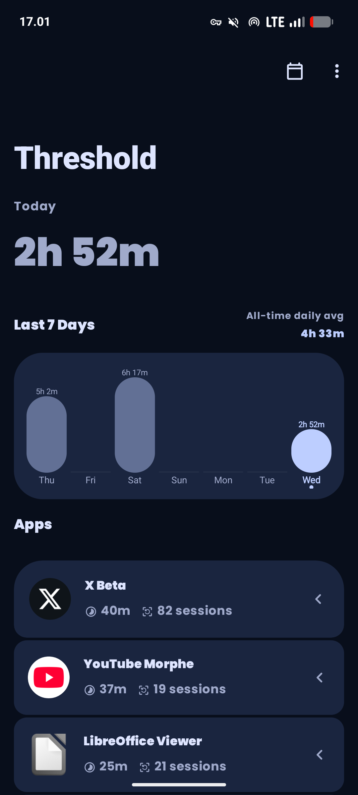
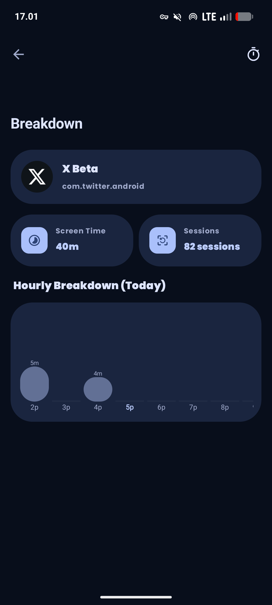
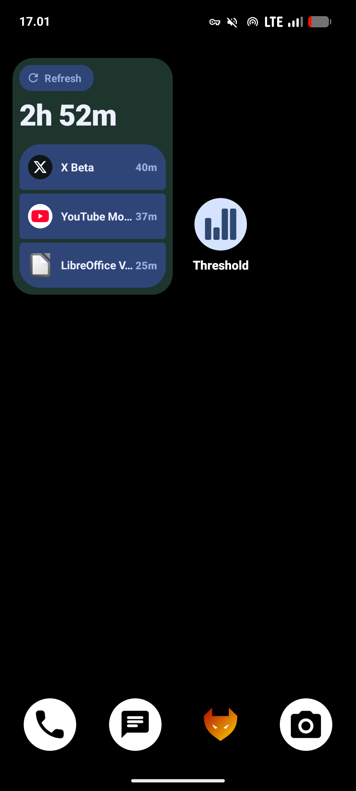

[](https://github.com/alfahrel/threshold/releases)
[](https://developer.android.com)
[](LICENSE)

# Threshold

A screen time management app built with **native Android (Kotlin/XML)**. Track app usage, set timers, and manage your digital habits.

[](https://github.com/alfahrel/threshold/releases)

---

## Features

- Real-time app usage tracking with session details
- Set daily time limits (5-300 minutes) for apps
- Home screen widgets (1x1 and 2x2 sizes)
- Charts and hourly breakdowns
- Filter out apps you don't want to track
- All data stays on your device, no internet required
- Device Admin protection to prevent uninstallation

---

## Screenshots

<div style="display: flex; justify-content: space-around; gap: 10px;">
  
  
  
</div>

---

## Tech Stack

- **Language:** Kotlin & XML
- **Framework:** Native Android
- **UI:** Material Design 3
- **Charts:** MPAndroidChart
- **Platform:** Android (API 24+)
- **Target SDK:** API 36

---

## Getting Started

### Prerequisites

- [Android Studio](https://developer.android.com/studio) (latest stable version)
- Android device or emulator (API 24+)

### Installation

1. Clone the repository:
   ```bash
   git clone https://github.com/alfahrel/threshold.git
   cd threshold
   ```

2. Open the project in Android Studio.

3. Sync Gradle and run the app on your device/emulator.

---

### Build APK

```bash
# Debug APK
./gradlew assembleDebug

# Release APK
./gradlew assembleRelease
```

The APK will be in `app/build/outputs/apk/`

---

## Required Permissions

The app requires these permissions:

1. **Usage Access** – Track app usage statistics
2. **Accessibility Service** – Monitor app activity and enforce timers
3. **Display Over Other Apps** – Show timer notifications
4. **Device Administrator** – Prevent unauthorized app removal

All permissions are requested on first launch with explanations.

---

## Contributing

If you'd like to contribute:
- Fork the project
- Open issues for bugs or feature requests
- Submit pull requests
- Follow Kotlin/Android style guidelines

---
## License

This project is licensed under the **GNU General Public License v3.0**. See the [LICENSE](LICENSE) file for details.

---
## Acknowledgments

- Built with [Android](https://developer.android.com)
- Charts by [MPAndroidChart](https://github.com/PhilJay/MPAndroidChart)
- Inspired by Digital Wellbeing
